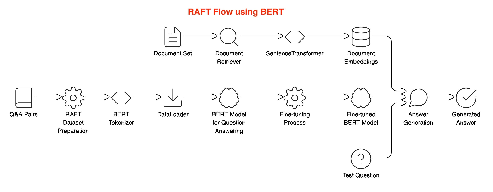
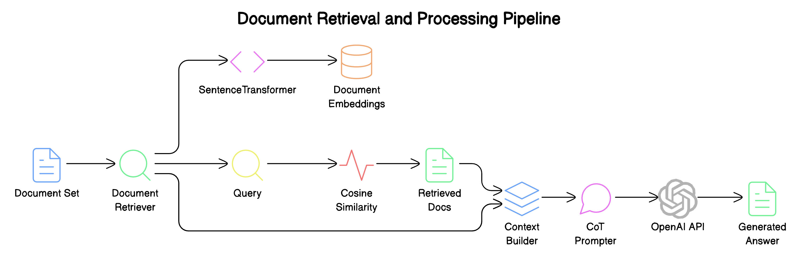

# 
RAFT Implementation: Sample RAFT Implementation using BERT, CoT, Few-Shot

<strong>An example and educational implementation of RAFT using BERT, Chain of Thought and Few-Shot!</strong>

This repository contains three different implementations of the Retrieval-Augmented Fine-Tuning (RAFT) technique for question answering:

1. RAFT using BERT
2. RAFT with Few-Shot Learning
3. RAFT with Chain-of-Thought (CoT) Reasoning

## 1. RAFT using BERT

### Summary
This implementation uses BERT (Bidirectional Encoder Representations from Transformers) for the RAFT process. It fine-tunes a BERT model on a dataset of question-answer pairs, using retrieved documents as context.

### Steps
1. Initialize the DocumentRetriever with a set of documents
2. Prepare the dataset using RAFTDataset
3. Fine-tune the BERT model using the prepared dataset
4. Use the fine-tuned model to generate answers for new questions

### Key Components
- DocumentRetriever: Uses SentenceTransformer to encode documents and retrieve relevant ones
- RAFTDataset: Prepares the data for BERT fine-tuning
- train_raft: Fine-tunes the BERT model
- generate_answer: Uses the fine-tuned model to generate answers

### Usage
Run `python raft-bert.py` to execute this implementation.

## 2. RAFT with Few-Shot Learning

### Summary
This implementation uses few-shot learning with GPT-3.5-turbo to perform RAFT. It retrieves relevant documents and uses a few examples to guide the model in generating answers.

### Steps
1. Initialize the DocumentRetriever with a set of documents
2. Generate few-shot examples using training data
3. For each test question:
   a. Retrieve relevant documents
   b. Generate an answer using few-shot examples and retrieved context

### Key Components
- DocumentRetriever: Uses SentenceTransformer to encode documents and retrieve relevant ones
- generate_raft_examples: Creates few-shot examples for the model
- generate_raft_answer: Uses GPT-3.5-turbo to generate answers based on few-shot examples and context

### Usage
Run `python raft-few-shot.py` to execute this implementation.

## 3. RAFT with Chain-of-Thought (CoT) Reasoning

### Summary
This implementation combines RAFT with Chain-of-Thought (CoT) reasoning using GPT-4. It retrieves relevant documents and prompts the model to provide step-by-step explanations for its answers.

### Steps
1. Initialize the DocumentRetriever with a set of documents
2. For each test question:
   a. Retrieve relevant documents
   b. Generate a CoT answer using GPT-4 with the retrieved context

### Key Components
- DocumentRetriever: Uses SentenceTransformer to encode documents and retrieve relevant ones
- generate_cot_answer: Uses GPT-4 to generate step-by-step explanations and answers

### Usage
Run `python raft-cot.py` to execute this implementation.

## Comparison of Techniques

1. RAFT using BERT:
   - Pros: Fine-tuned on specific data, can be faster at inference time
   - Cons: Requires more data and computational resources for training

2. RAFT with Few-Shot Learning:
   - Pros: Requires less training data, more flexible for different types of questions
   - Cons: Relies on the quality of few-shot examples, may be less consistent

3. RAFT with Chain-of-Thought (CoT) Reasoning:
   - Pros: Provides detailed explanations, potentially more accurate for complex questions
   - Cons: May be slower due to generating longer responses, requires more powerful language model (GPT-4)

## Requirements

- Python 3.7+
- PyTorch
- Transformers
- SentenceTransformer
- OpenAI API key (for Few-Shot and CoT implementations)

## Setup

1. Install the required packages: `pip install torch transformers sentence-transformers openai`
2. Set your OpenAI API key as an environment variable: `export OPENAI_API_KEY=your_api_key_here`
3. Run the desired implementation as described in the Usage sections above.

## Note

These implementations are for educational purposes and may require further optimization for production use. Always consider the ethical implications and potential biases when using language models for question answering tasks.